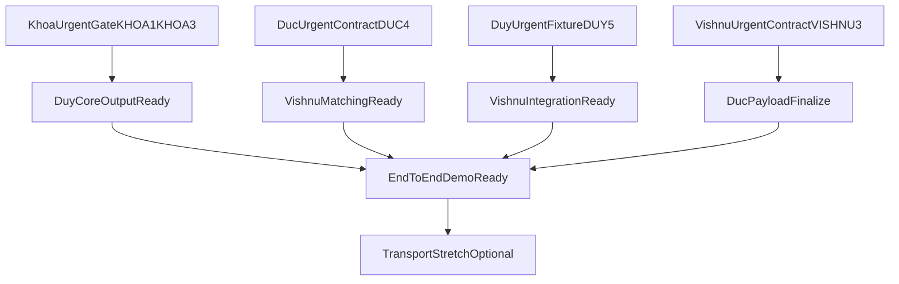

# UrbanShield MVP (2-Day) — Master Orchestration

This is the single source of truth for the 2-day prototype sprint.

All collaborators must start here, then follow their assigned task file:
- [Duy task file](./MVP_2DAY_DUY.md)
- [Khoa task file](./MVP_2DAY_KHOA.md)
- [Duc task file](./MVP_2DAY_DUC.md)
- [Vishnu task file](./MVP_2DAY_VISHNU.md)
- [Sprint status board](./MVP_2DAY_STATUS.md)

## Branch Strategy (mandatory)

Each collaborator works only on their dedicated branch:
- Duy: `mvp2day/duy-data-ingest`
- Khoa: `mvp2day/khoa-data-contract`
- Duc: `mvp2day/duc-route-planning`
- Vishnu: `mvp2day/vishnu-safety-scoring`

Do not commit directly to `main`.

## Hybrid Delivery Model (recommended)

This sprint uses a hybrid execution model:
- **Step 1 (short prerequisite window):** 60-120 minutes for minimum interface and unblocker tasks.
- **Step 2 (mostly independent build):** each collaborator executes their own track in parallel.
- **Step 3 (scheduled integration windows):** resolve overlap and finalize end-to-end flow.

Target split for this 2-day MVP:
- prerequisite/gates: about 20 percent
- independent execution: about 70 percent
- integration/polish: about 10 percent

## 1) Baseline Validation (already present in codebase)

Validated from current repository state:
- Map-first reporting flow exists on `apps/web/app/map/page.tsx`.
- Legacy report route redirects to map at `apps/web/app/report/page.tsx`.
- API integration client exists in `apps/web/lib/api.ts`.
- Incident API endpoints exist in `services/api/routes/incidents.py` (`POST /incidents`, `GET /incidents`).
- Ownership guardrails already documented in `FEATURE_REGISTRY.md` and `instruction.md`.

Conclusion: team should build on existing baseline, not re-implement from scratch.

## 2) Prototype Strategy (What is Simplified)

- **Crawling:** limited connectors or seeded sample feeds in scheduled batches (not real-time stream).
- **Extraction:** lightweight parsing and keyword rules for incident type and duration class.
- **Routing:** 2-3 route alternatives via simple path variation logic.
- **Safety score:** weighted incident count/proximity formula with transparent explanation.
- **Public transport:** optional stretch only after core demo is stable.

## 3) Shared Interfaces (Freeze in Phase 0)

These are mandatory handoff contracts between data and routing.

### Incident object
- `id`
- `source`
- `type`
- `timestamp`
- `lat`
- `lng`
- `duration_class` (`short_term` or `long_term`)
- `confidence` (optional for MVP)

### Route request
- `origin`
- `destination`
- optional `time_context`

### Route response
- `routes` (2-3 alternatives)
- each route contains:
  - `route_id`
  - `geometry`
  - `safety_score`
  - `incident_refs`
  - `explanation`

## 4) Ownership Boundaries (Conflict Prevention)

Non-negotiable path ownership:
- **Duy:** crawling connector A and ingestion scheduling files only.
- **Khoa:** normalization/classification/schema validation files only.
- **Duc:** route generation and route contract files only.
- **Vishnu:** scoring, ranking, and route incident inspection files only.

Shared files are edited only in integration windows and only by pre-agreed pair owners.

### Hard allowlists (exact repo-tree boundaries)

These are write-allow boundaries. If a path is not listed for a collaborator, it is read-only for them.

- **Duy write allowlist**
  - `scripts/ingest_social.py`
  - `scripts/ingest/**` (new files allowed under this folder)
  - `services/api/main.py` (only ingestion job wiring; no route contract edits)
  - `docs/agents/MVP_2DAY_DUY.md`
- **Khoa write allowlist**
  - `services/api/routes/incidents.py` (classification/validation logic only)
  - `services/api/models.py` (schema-level incident fields only)
  - `libs/schemas/incident.ts` (shared incident shape alignment)
  - `docs/agents/MVP_2DAY_KHOA.md`
- **Duc write allowlist**
  - `apps/web/lib/routing/**` (new route planner module files)
  - `apps/web/app/map/page.tsx` (route options rendering hooks only)
  - `docs/agents/MVP_2DAY_DUC.md`
- **Vishnu write allowlist**
  - `apps/web/lib/safety/**` (new scoring/matching module files)
  - `apps/web/app/map/page.tsx` (safety-score display hooks only, only after merge window)
  - `docs/agents/MVP_2DAY_VISHNU.md`
- **Sprint lead only**
  - `docs/agents/MVP_2DAY_ORCHESTRATION.md`
  - `docs/agents/MVP_2DAY_STATUS.md`

`apps/web/app/map/page.tsx` is a controlled overlap file. Duc and Vishnu must edit this file in serial integration windows only.

### Branch and allowlist matrix (single reference)

- `mvp2day/duy-data-ingest`
  - allowed writes: `scripts/ingest_social.py`, `scripts/ingest/**`, `services/api/main.py`, `docs/agents/MVP_2DAY_DUY.md`
- `mvp2day/khoa-data-contract`
  - allowed writes: `services/api/routes/incidents.py`, `services/api/models.py`, `libs/schemas/incident.ts`, `docs/agents/MVP_2DAY_KHOA.md`
- `mvp2day/duc-route-planning`
  - allowed writes: `apps/web/lib/routing/**`, `apps/web/app/map/page.tsx` (route UI only), `docs/agents/MVP_2DAY_DUC.md`
- `mvp2day/vishnu-safety-scoring`
  - allowed writes: `apps/web/lib/safety/**`, `apps/web/app/map/page.tsx` (safety UI only, serial window), `docs/agents/MVP_2DAY_VISHNU.md`

Merge safety:
- Merge order for controlled-overlap work: Khoa -> Duy -> Duc -> Vishnu.
- If `apps/web/app/map/page.tsx` has conflicts, resolve in a dedicated integration PR, not in feature PRs.

## Critical Unblocker Matrix (urgent-first tasks)

These urgent tasks unlock downstream work. Each owner should prioritize these first in the prerequisite window.

- **Khoa urgent unblockers**
  - `KHOA-1` + `KHOA-3` unblock Duy core ingestion output (`DUY-3`, `DUY-6`).
- **Duy urgent unblockers**
  - `DUY-5` unblock Vishnu integration validation (`VISHNU-5`).
- **Duc urgent unblockers**
  - `DUC-4` unblock Vishnu geometry-based matching (`VISHNU-1`).
- **Vishnu urgent unblockers**
  - `VISHNU-3` unblock Duc route payload finalization (`DUC-5`, `DUC-7`).

If an urgent task is delayed, backup owner takes over immediately using takeover protocol.

### Urgent dependency scenarios (all 4 collaborators)

- **Scenario A (Khoa -> Duy):** if `KHOA-1` or `KHOA-3` is late, Duy continues scaffold work (`DUY-1`, `DUY-2`, `DUY-4`, `DUY-5`) but cannot close `DUY-3`/`DUY-6`.
- **Scenario B (Duy -> Vishnu):** if `DUY-5` is late, Vishnu proceeds with scoring logic and mock data, but delays `VISHNU-5` signoff.
- **Scenario C (Duc -> Vishnu):** if `DUC-4` is late, Vishnu progresses `VISHNU-2/3/4` and stubs geometry matcher until contract lands.
- **Scenario D (Vishnu -> Duc):** if `VISHNU-3` is late, Duc finalizes route generation and UI, but keeps `DUC-5`/`DUC-7` in ready-to-merge state.

### Primary and backup ownership (for seamless takeover)

Every task has a primary owner and one backup owner who can take over immediately if needed.

- **Data lane**
  - Khoa primary, Duy backup for schema/classification prerequisites.
  - Duy primary, Khoa backup for connector and ingestion execution.
- **Routing lane**
  - Duc primary, Vishnu backup for route generation contract.
  - Vishnu primary, Duc backup for scoring and ranking integration.

## 5) Master Task Board (Manager View)

Status values: `PENDING`, `IN_PROGRESS`, `BLOCKED`, `DONE`.

- [ ] `T0` Interface freeze completed and signed by all four collaborators (`PENDING`) | Primary: Khoa | Backup: Duy
- [ ] `T1` Data ingestion pipeline demo-ready (`PENDING`) | Primary: Duy | Backup: Khoa
- [ ] `T2` Incident extraction + duration classification demo-ready (`PENDING`) | Primary: Khoa | Backup: Duy
- [ ] `T3` Route alternatives (2-3) generated from sample O/D (`PENDING`) | Primary: Duc | Backup: Vishnu
- [ ] `T4` Safety scoring integrated with incidents (`PENDING`) | Primary: Vishnu | Backup: Duc
- [ ] `T5` Route incident inspection output available (`PENDING`) | Primary: Vishnu | Backup: Duc
- [ ] `T6` End-to-end scripted demo passes (`PENDING`) | Primary: Duc | Backup: Duy
- [ ] `T7` Public transport linkage (stretch) (`PENDING`) | Primary: Duy | Backup: Khoa

Update protocol:
- Each collaborator updates only their own collaborator file.
- Sprint lead updates this master board at two checkpoints per day.
- Do not have all collaborators edit this file continuously (avoids merge conflicts).

Assumption and implementation drift protocol:
- Every collaborator must log any assumption in their file before coding.
- If implementation differs from original task intent, add a `DELTA` log entry with:
  - task ID,
  - what changed,
  - why it changed,
  - compatibility impact,
  - required downstream adjustments.
- Sprint lead reflects accepted deltas in `MVP_2DAY_STATUS.md` at next checkpoint.

## 6) Parallelization and Dependencies

Timezone sequencing requirement:
- **Khoa urgent tasks must be done first to unlock Duy core data tasks.**
- Required Duy start gate: `KHOA-1` + `KHOA-3`.

Can start immediately (independent):
- Khoa: `KHOA-1`, `KHOA-2`, `KHOA-3`.
- Duc: `DUC-1`, `DUC-2`, `DUC-3`.
- Vishnu: `VISHNU-2`, `VISHNU-3`, `VISHNU-4`.
- Duy: `DUY-1`, `DUY-2`, `DUY-4`, `DUY-5` prework and scaffolding.

Starts after urgent unblockers:
- Duy production-ready core output (`DUY-3`, `DUY-6`) after `KHOA-1` + `KHOA-3`.
- Vishnu geometry matching (`VISHNU-1`) after `DUC-4`.
- Vishnu integration (`VISHNU-5`) after `DUY-5`.
- Duc route payload finalization (`DUC-5`, `DUC-7`) after `VISHNU-3`.

Dependencies:
- `T1` finalization depends on Khoa urgent gate (`KHOA-1` + `KHOA-3`).
- `T4` depends on `T1` + `T2` + `T3` at integration checkpoint.
- `T5` depends on `T4` at integration checkpoint.
- `T6` depends on `T5`.
- `T7` depends on `T6` (core stable first).

## 7) 2-Day Execution Phases

### Phase 0 — Setup (2-3 hours)
- Freeze interfaces.
- Confirm ownership boundaries.
- Prepare deterministic test fixtures.
- Complete urgent unblockers kickoff:
  - Khoa starts `KHOA-1` and `KHOA-3`.
  - Duc starts `DUC-4`.
  - Duy starts `DUY-5`.
  - Vishnu starts `VISHNU-3`.

Output: signed interface contract + task kickoff.

### Phase 1 — Parallel Core Build (Day 1)
- After first urgent unblockers, all four run mostly independent tracks.
- Khoa continues classification hardening and compatibility.
- Duy continues ingestion execution and validation.
- Duc continues route generation and route demo quality.
- Vishnu continues scoring and route inspection behavior.

Output: independently testable modules.

### Phase 2 — Integration (Day 2 morning)
- Integrate incident snapshot with scoring.
- Validate route ranking and incident inspection.

Output: end-to-end flow works.

### Phase 3 — Demo Prep (Day 2 afternoon)
- Script demo scenarios (safe vs risky path).
- Polish reliability and fallback dataset behavior.
- Add stretch only if core is stable.

Output: stakeholder-ready MVP demo.

## 8) Working Rules (Professional Delivery Standards)

- No one edits another collaborator's owned module without explicit handoff.
- Interface change requests must be approved by all four collaborators.
- Every task completion requires:
  - demo evidence (CLI output, UI screenshot, or payload sample),
  - updated checklist in collaborator file,
  - short integration note for downstream owner.
- Keep PRs small and single-purpose.
- Merge in agreed order after checkpoint validation.

### Takeover protocol (if primary owner is unavailable)

To guarantee that person B can continue person A's tasks with no delay, every in-progress task must maintain:
- current status (`PENDING`, `IN_PROGRESS`, `BLOCKED`, `DONE`)
- latest touched files
- next exact step in one line
- known edge cases or failing checks

Backup owner may take over immediately by:
1. copying the task ID into their collaborator file under a `TAKEOVER` note,
2. continuing from recorded next step,
3. posting completion evidence and handoff note.

No meeting is required for takeover if the task record is complete.

### Conflict scan protocol (mandatory before marking DONE)

Each task completion requires a quick conflict scan:
1. check touched files vs allowlist boundaries,
2. check interface compatibility (`incident` and `route` contract),
3. check overlap with completed tasks from other collaborators,
4. if conflict risk exists, log `CONFLICT_CANDIDATE` in collaborator file and mark task `BLOCKED`,
5. after adjustment, add `RESOLVED_CONFLICT` note and continue.

### AI planning mode micro-task protocol (for smaller pending tasks)

When a pending task is too broad, collaborator must split it into 2-4 micro-tasks in their own file:
- format: `<owner>-<task-id>-A/B/C`
- each micro-task must include:
  - exact output artifact,
  - exact target files,
  - dependency,
  - done criteria.

Example:
- `KHOA-3-A`: add schema guard check for missing `duration_class`
- `KHOA-3-B`: add fallback to `short_term` for unknown keywords
- `KHOA-3-C`: publish compatibility note for Duy and Vishnu

## 9) How Collaborators Use This

1. Open this file.
2. Open your collaborator file linked at top.
3. Execute tasks in order and keep status current.
4. At checkpoint, report blockers and completed task IDs.
5. Only after core tasks are done, start stretch work.

## 10) Balanced Workload Commitment

Workload target is balanced across all four collaborators:
- each collaborator has 7 tasks in their packet,
- each packet includes core build + integration + demo support,
- Khoa receives prerequisite-first sequencing for timezone reasons, while Duy receives larger execution load after the gate to keep overall effort balanced.

## 11) Change Visibility Guarantees

To ensure collaborators know exactly what was done differently:
- each collaborator file contains:
  - `Assumptions Log`,
  - `Implementation Delta Log`,
  - `Conflict Scan Log`,
  - `Takeover Notes`.
- status board includes:
  - accepted deltas,
  - open conflict candidates,
  - takeover events.
