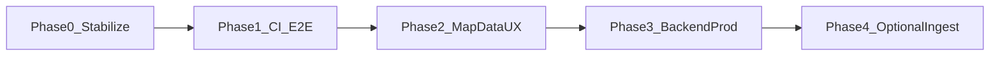

# UrbanShield — collaborator instructions & planning

**Purpose:** This file summarizes **what is already implemented** in this repo, **what is still open**, and **how each role can plan next work** without stepping on others. It complements [README.md](./README.md) (how to run) and [FEATURE_REGISTRY.md](./FEATURE_REGISTRY.md) (file ownership).

**Sprint note (MVP 2-day with named collaborators):** execution now uses [docs/agents/MVP_2DAY_ORCHESTRATION.md](./docs/agents/MVP_2DAY_ORCHESTRATION.md) as the single orchestration source plus per-collaborator task files.

**Last updated:** April 2026 (sync with `main` / your branch before relying on paths).

---

## 1. Product snapshot (what the app does today)

- **Map-first reporting:** On **`/map`**, users tap **➕ Report** (FAB). A **bottom sheet** opens over a **fullscreen** Mapbox map. They pick **location** (GPS default, **move map under a fixed pin**, or **Mapbox geocoder search**), **category** (large icon buttons), optional **description**, then **Report incident**. The UI adds a marker **optimistically** and shows a **toast**; the API persists the incident.
- **Region:** Map is **bounded** to Greater **Melbourne + Geelong** (`apps/web/app/map/region.ts`). Fallback center uses `NEXT_PUBLIC_MAP_DEFAULT` (`melbourne` | `geelong`) when GPS is unavailable.
- **Legacy `/report`:** Not a full form anymore — **redirect / help** pointing users to **`/map`** (`apps/web/app/report/page.tsx`).
- **Backend:** FastAPI **`POST /incidents`** and **`GET /incidents`** with SQLite, fixed JSON contract ([README](./README.md)).
- **Optional:** `scripts/ingest_social.py` (Reddit keyword demo; rarely inserts rows without coordinates in text).

---

## 2. Frozen rules (do not break these)

1. **API contract** — Request/response shapes for `POST /incidents` and `GET /incidents` are **fixed** (see [README.md](./README.md)). Coordinate any change with the whole team and version the API.
2. **Secrets** — Never commit `.env`, `.env.local`, or tokens. Use `*.env.example` only in Git.
3. **Mapbox tokens in the browser** — Use a **public** token (`pk.*`). Secret tokens (`sk.*`) will not work with Mapbox GL / geocoder in the web app.

---

## 3. What has been done (by area)

| Area | Status | Key paths |
|------|--------|-----------|
| **Backend API + SQLite** | Implemented | `services/api/` (`main.py`, `database.py`, `models.py`, `routes/incidents.py`) |
| **Frontend — map + reporting UX** | Implemented | `apps/web/app/map/**` (sheet, FAB, geocoder, categories, toast, `region.ts`, `mapColors.ts`) |
| **Frontend — API client** | Implemented | `apps/web/lib/api.ts` (`createIncident`, `getIncidents`) |
| **Shared TS types** | Implemented | `libs/schemas/incident.ts` |
| **Landing page** | Implemented | `apps/web/app/page.tsx` |
| **`/report` route** | Redirect / help only | `apps/web/app/report/page.tsx` |
| **Conda / Python deps** | Documented | `environment.yml`, `services/api/requirements.txt` |
| **Multi-agent docs** | Documented | `docs/agents/**`, [MULTI_AGENT_PLAYBOOK.md](./MULTI_AGENT_PLAYBOOK.md) |
| **Production build (`npm run build`)** | **Not reliably verified** on shared login nodes (runs can be slow or aborted). **Typecheck** (`npx tsc --noEmit` in `apps/web`) has been used as a faster check. | Run `npm run build` locally or in CI when possible. |

---

## 4. Suggested pending tasks — by role (for careful planning)

Use [FEATURE_REGISTRY.md](./FEATURE_REGISTRY.md) as the **file boundary** table. Below is **suggested** follow-up work; assign owners in your stand-up.

### Person 1 — Backend (`services/api/*`)

| Priority | Task | Notes |
|----------|------|--------|
| P1 | **CI smoke test** for API | e.g. `pytest` or script: health + POST + GET with temp DB |
| P2 | **Production hardening** (if deploying) | Rate limits, auth, stricter `CORS_ORIGINS`, HTTPS |
| P3 | **PostgreSQL** (optional) | Replace SQLite when you need concurrency; keep same API shapes |
| P4 | **`description` optional in API** (optional) | Today `min_length=1`; map UI sends a fallback string. Aligning API + contract docs would need team agreement |

### Person 2 — Map UI (`apps/web/app/map/**`)

| Priority | Task | Notes |
|----------|------|--------|
| P1 | **Refetch incidents when map centre changes** | Today initial load uses startup centre; panning may not refresh markers unless **Refresh** |
| P2 | **Accessibility** | Sheet focus trap, ARIA labels, keyboard dismiss |
| P3 | **Marker popups / clustering** | If many incidents, cluster or tap-for-detail |
| P4 | **Offline / slow API** | Clearer empty states; retry |

### Person 3 — Report route (`apps/web/app/report/**`)

| Priority | Task | Notes |
|----------|------|--------|
| P1 | **Keep redirect aligned with marketing** | Copy, analytics, or deep-link `?from=report` if needed |
| P2 | **Avoid duplicating reporting forms here** | Primary UX stays on `/map` |

### Person 4 — Integration (`apps/web/lib/`, `apps/web/app/page.tsx`, `libs/schemas/`, `scripts/`)

| Priority | Task | Notes |
|----------|------|--------|
| P1 | **CI: `npm ci` + `npm run build` + `tsc`** | Proves web bundle on a clean runner |
| P2 | **Centralized error / retry** in `lib/api.ts` | Optional small wrapper for `fetch` |
| P3 | **Env docs** | Geocoder needs token scopes; document in README if teammates hit 403 |
| P4 | **Optional ingestion** | Harden `scripts/ingest_social.py` or document limitations |

### Whole team

| Priority | Task | Notes |
|----------|------|--------|
| P1 | **E2E checklist** | Home → Map → Report → marker + DB row (see README demo flow) |
| P2 | **Branch hygiene** | `feature/backend-api`, `feature/map-ui`, `feature/report-ui`, `feature/integration` per [FEATURE_REGISTRY](./FEATURE_REGISTRY.md) |

---

## 5. Overall plan (phased roadmap)

Use this as a **sequence** for planning sprints; parallelize only where paths do not overlap.



| Phase | Goal | Typical owners | Exit criteria |
|-------|------|----------------|-----------------|
| **0 — Stabilize** | Everyone can run app locally | All | README steps work; `.env.example` sufficient |
| **1 — CI & E2E** | Automated checks | P1 + P4 | API + web build (or tsc + API test) in CI; smoke script documented |
| **2 — Map & data UX** | Markers stay correct as user moves map | P2 (+ P4 if touching `lib/api.ts`) | Pan/zoom updates or explicit “search this area” |
| **3 — Backend production** | Deploy-ready API | P1 | CORS, logging, DB backup, optional Postgres |
| **4 — Optional ingestion** | Reddit script in prod | P4 | Runbook + secrets policy; no PII leaks |

---

## 6. Quick commands (copy-paste)

**Web**

```bash
cd apps/web && npm install && npm run dev
# Faster typecheck:
npx tsc --noEmit
# Full production build (when machine has time):
npm run build
```

**API (Conda — adjust to your site’s `module load` / env path)**

```bash
cd services/api && uvicorn main:app --reload --host 0.0.0.0 --port 8000
```

---

## 7. Related documents

| Document | Use |
|----------|-----|
| [README.md](./README.md) | Install, env vars, API contract, demo flow |
| [FEATURE_REGISTRY.md](./FEATURE_REGISTRY.md) | **Who owns which paths** |
| [docs/agents/README.md](./docs/agents/README.md) | Multi-agent / parallel work without conflicts |
| [instruction.md](./instruction.md) | This file — **status + planning** |

---

## 8. How to update this file

After each meaningful merge, add a **one-line bullet** under §3 (what changed) and adjust §4 (pending) so the next collaborator sees a truthful snapshot. Prefer **small PRs** that update `instruction.md` together with the feature they ship.
